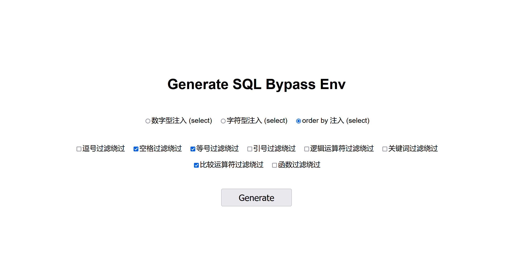
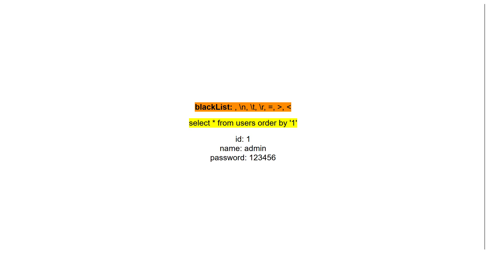

   #  Generate-SQL-Bypass-Env

### 简述

可以快速的生成一个 SQL 注入 waf 绕过的场景

允许通过修改配置快速的生成不同 **注入点** 和 **过滤规则** 的 SQL 注入场景

### 如何使用？

1. 打开目录下的 db.php，修改里面的 mysql 连接信息。
2. 导入默认的数据库文件，`source backup.sql`
3. 访问 index.php 即可进入到环境
4. 选择想要的注入点 (注入类型) 以及 过滤规则，点击 Generate 会自动生成并跳转到存在漏洞的页面
   - 注意：注入点 (注入类型) 只允许选择 1 种，若存在多个将会选择第一个有效的数据。
5. 来到存在漏洞的页面后，你只需要进行 Get 请求传递参数，就可以开始你的 SQL 注入 bypass 之旅啦！
   - 注意：无论你的参数名称是啥，它永远都会取你的值（即 ?name=1 和 ?id=1 是等效的）

### 如何添加新的注入点和过滤规则？

注意：请务必按照以下的规则去写入内容。

1. **修改注入点（注入类型）**

   1. 配置文件：`injectionPoint.php`
   2. 格式：`"name|show_name" => "SQL Condition"`
   3. name：每一个复选框中的 value 的值，仅允许使用 英文 和 下划线
   4. show_name：展示出来的选项，标题简短好懂即可，建议后面加上 () 来标识要执行的 mysql 操作
   5. SQL Condition：mysql 语句，要求使用 @ 符号来表示注入点，如果需要存在分号，则仅允许使用单引号（''）

2. **修改过滤规则**

   1. 配置文件：`sqlRule.php`

   2. 格式：`name|show_name => array(blacklist for input)`

   3. name：每一个复选框中的 value 的值，仅允许使用 英文 和 下划线

   4. show_name：展示出来的选项，标题简短好懂即可

   5. blacklist：用标准的 php 数组表示需要过滤的关键字即可

### 截图

